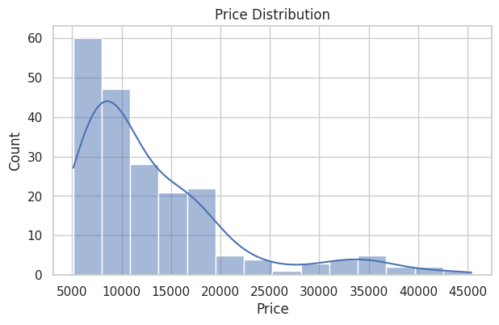
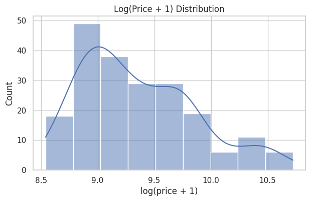
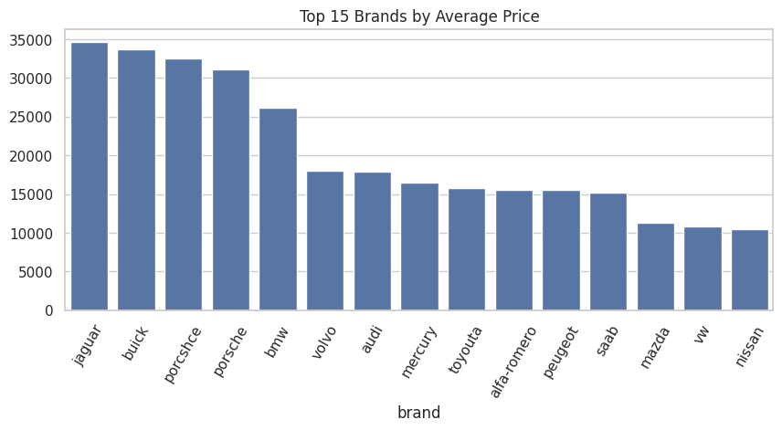
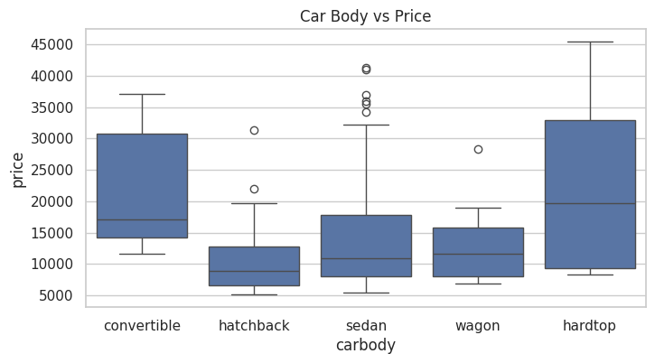
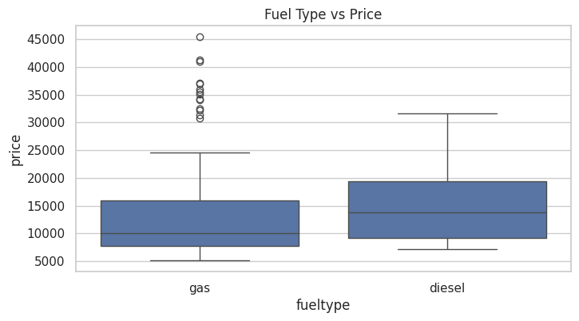
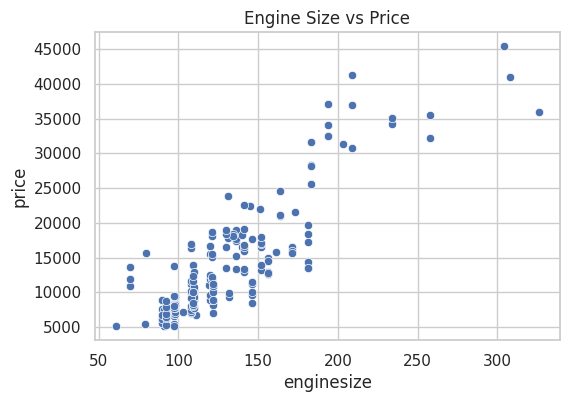
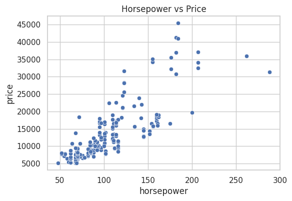
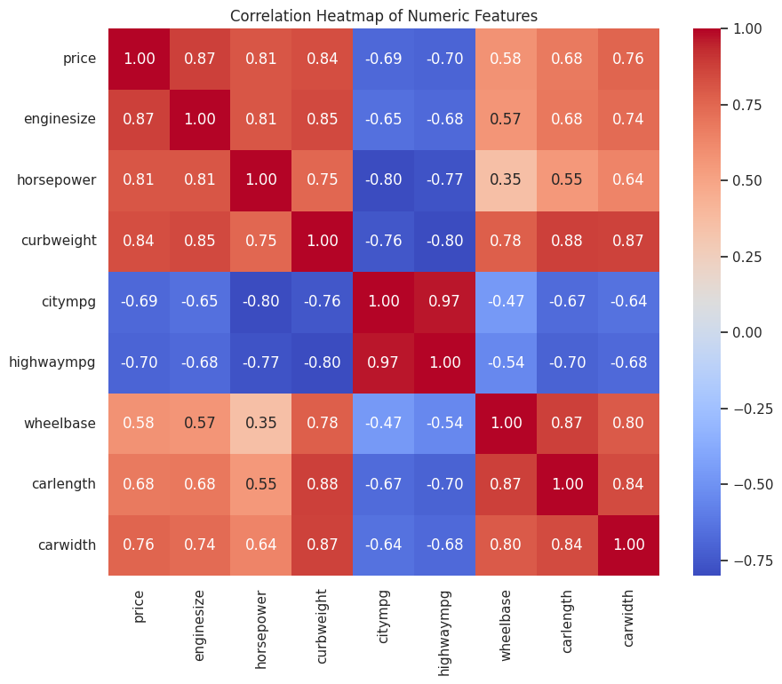

**Car Price Prediction**

A complete end-to-end machine learning application for predicting car prices using a Keras regression model, served via a Flask API, packaged in Docker, and displayed with a modern Tailwind-styled UI.
The project includes:

✔ Keras model (model.keras)
✔ Flask API (/predict + /health)
✔ Modern TailwindUI single-page front-end (index.html)
✔ Dockerized deployment
✔ Full Exploratory Data Analysis (EDA)
✔ Clean project structure

This project is trained on the dataset:
`CarPrice_Assignment.csv`

----
📦 Installation & Setup

1️⃣ Create Virtual Environment
```
python -m venv venv
source venv/bin/activate   # Linux/Mac
venv\Scripts\activate      # Windows
```


2️⃣ Install Requirements

`pip install -r requirements.txt`

3️⃣ Train Model
`python train.py`

4️⃣ Run Flask App

`python app.py`


RUN:
`http://127.0.0.1:5000`

----

🧠 Model Overview

✔ This project uses a Sequential Keras Neural Network with:

 ✔ Input layer: 14 standardized numeric features

✔ Dense hidden layers (ReLU activation)

✔ Output: 1 regression value (price)

✔ Optimizer: Adam

✔Loss: Mean Squared Error

✔ Model saved using the new .keras format for TensorFlow 2.12+ compatibility.
----

🔥 API Endpoints

✔ Health Check

`GET /health`

Response
```json
{
  "model": "ok",
  "feature_count": 14
}
```
✔ Prediction Endpoint
`POST /predict`

Example
```json

curl -X POST http://localhost:5000/predict ^
     -H "Content-Type: application/x-www-form-urlencoded" ^
     -d "symboling=0&wheelbase=100&carlength=170&carwidth=65&carheight=54&curbweight=2000&enginesize=120&boreratio=3.0&stroke=3.4&compressionratio=9.0&horsepower=100&peakrpm=5500&citympg=25&highwaympg=30"

```

----

🐳 Run with Docker

1️⃣ Build Docker Image
```docker build -t car-price-app .```

2️⃣ Run Container
```docker run --rm -p 5000:5000 car-price-app```


App runs at:
` http://127.0.0.1:5000`

----

📊 Exploratory Data Analysis (EDA)

1️⃣ Price Distribution

Raw Distribution



Log-Transformed Distribution




2️⃣ Brand-wise Average Price
Top 15 most expensive car brands based on dataset averages.



3️⃣ Car Body Type vs Price



4️⃣ Fuel Type vs Price



5️⃣ Feature Relationship with Price

Engine Size vs Price



Horsepower vs Price



6️⃣ Correlation Heatmap




🖥️ Front-End (Tailwind-Based UI)

A single index.html file includes:

✔ Stylish glassmorphism UI
✔ Real-time prediction result section
✔ Responsive grid layout
✔ Tailwind CDN only
✔ No additional JS required


